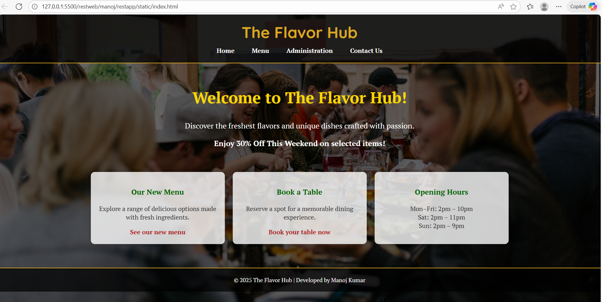

# Ex.07 Restaurant Website
## Date: 04/10/2025

## AIM:
To develop a static Restaurant website to display the food items and services provided by them.

## DESIGN STEPS:

### Step 1:
Requirement collection.

### Step 2:
Creating the layout using HTML and CSS.

### Step 3:
Updating the sample content.

### Step 4:
Choose the appropriate style and color scheme.

### Step 5:
Validate the layout in various browsers.

### Step 6:
Validate the HTML code.

### Step 7:
Publish the website in the given URL.

## PROGRAM:
```
index.html

<!DOCTYPE html>
<html lang="en">
<head>
    <meta charset="UTF-8">
    <meta name="viewport" content="width=device-width, initial-scale=1.0">
    <title>The Flavor Hub</title>
    <link href="https://fonts.googleapis.com/css?family=Quicksand:700|PT+Serif:400,700" rel="stylesheet">
    <style>
        body {
            margin: 0;
            padding: 0;
            min-height: 100vh;
            background: linear-gradient(rgba(0, 0, 0, 0.6), rgba(0, 0, 0, 0.6)), 
                        url('https://images.unsplash.com/photo-1528605248644-14dd04022da1') no-repeat center center/cover;
            font-family: 'PT Serif', serif;
            color: white;
        }

        header {
            background: rgba(0, 0, 0, 0.7);
            text-align: center;
            padding: 20px 0;
            border-bottom: 2px solid goldenrod;
        }

        header h1 {
            font-family: 'Quicksand', sans-serif;
            font-size: 2.5em;
            color: goldenrod;
            margin: 0;
        }

        nav {
            margin-top: 10px;
        }

        nav a {
            color: white;
            margin: 0 20px;
            text-decoration: none;
            font-weight: bold;
            transition: color 0.3s;
        }

        nav a:hover {
            color: goldenrod;
        }

        .welcome {
            text-align: center;
            margin-top: 60px;
        }

        .welcome h2 {
            font-size: 2.5em;
            color: #FFD700;
        }

        .welcome p {
            font-size: 1.2em;
        }

        .boxes {
            display: flex;
            justify-content: center;
            flex-wrap: wrap;
            margin: 60px 20px;
            gap: 20px;
        }

        .box {
            background: rgba(255, 255, 255, 0.8);
            color: #333;
            border-radius: 10px;
            padding: 20px;
            width: 300px;
            text-align: center;
            box-shadow: 0 0 10px rgba(0,0,0,0.3);
            transition: transform 0.3s;
        }

        .box:hover {
            transform: translateY(-5px);
        }

        .box h3 {
            color: #006400;
        }

        .box a {
            color: #b22222;
            font-weight: bold;
            text-decoration: none;
        }

        .box a:hover {
            text-decoration: underline;
        }

        footer {
            text-align: center;
            padding: 20px;
            background: rgba(0, 0, 0, 0.7);
            border-top: 2px solid goldenrod;
            color: white;
            font-size: 0.9em;
        }
    </style>
</head>
<body>

    <header>
        <h1>The Flavor Hub</h1>
        <nav>
            <a href="#">Home</a>
            <a href="#">Menu</a>
            <a href="#">Administration</a>
            <a href="#">Contact Us</a>
        </nav>
    </header>

    <section class="welcome">
        <h2>Welcome to The Flavor Hub!</h2>
        <p>Discover the freshest flavors and unique dishes crafted with passion.</p>
        <p><strong>Enjoy 30% Off This Weekend on selected items!</strong></p>
    </section>

    <section class="boxes">
        <div class="box">
            <h3>Our New Menu</h3>
            <p>Explore a range of delicious options made with fresh ingredients.</p>
            <a href="#">See our new menu</a>
        </div>

        <div class="box">
            <h3>Book a Table</h3>
            <p>Reserve a spot for a memorable dining experience.</p>
            <a href="#">Book your table now</a>
        </div>

        <div class="box">
            <h3>Opening Hours</h3>
            <p>
                Mon–Fri: 2pm – 10pm<br>
                Sat: 2pm – 11pm<br>
                Sun: 2pm – 9pm
            </p>
        </div>
    </section>

    <footer>
        © 2025 The Flavor Hub | Developed by Manoj Kumar
    </footer>

</body>
</html>


menu.html

<!DOCTYPE html>
<html lang="en">
<head>
    <meta charset="UTF-8">
    <meta name="viewport" content="width=device-width, initial-scale=1.0">
    <title>The Flavor Hub</title>
    <link href="https://fonts.googleapis.com/css?family=Quicksand:700|PT+Serif:400,700" rel="stylesheet">
    <style>
        body {
            margin: 0;
            padding: 0;
            min-height: 100vh;
            background: linear-gradient(rgba(0, 0, 0, 0.6), rgba(0, 0, 0, 0.6)), 
                        url('https://images.unsplash.com/photo-1528605248644-14dd04022da1') no-repeat center center/cover;
            font-family: 'PT Serif', serif;
            color: white;
        }

        header {
            background: rgba(0, 0, 0, 0.7);
            text-align: center;
            padding: 20px 0;
            border-bottom: 2px solid goldenrod;
        }

        header h1 {
            font-family: 'Quicksand', sans-serif;
            font-size: 2.5em;
            color: goldenrod;
            margin: 0;
        }

        nav {
            margin-top: 10px;
        }

        nav a {
            color: white;
            margin: 0 20px;
            text-decoration: none;
            font-weight: bold;
            transition: color 0.3s;
        }

        nav a:hover {
            color: goldenrod;
        }

        .welcome {
            text-align: center;
            margin-top: 60px;
        }

        .welcome h2 {
            font-size: 2.5em;
            color: #FFD700;
        }

        .welcome p {
            font-size: 1.2em;
        }

        .boxes {
            display: flex;
            justify-content: center;
            flex-wrap: wrap;
            margin: 60px 20px;
            gap: 20px;
        }

        .box {
            background: rgba(255, 255, 255, 0.8);
            color: #333;
            border-radius: 10px;
            padding: 20px;
            width: 300px;
            text-align: center;
            box-shadow: 0 0 10px rgba(0,0,0,0.3);
            transition: transform 0.3s;
        }

        .box:hover {
            transform: translateY(-5px);
        }

        .box h3 {
            color: #006400;
        }

        .box a {
            color: #b22222;
            font-weight: bold;
            text-decoration: none;
        }

        .box a:hover {
            text-decoration: underline;
        }

        footer {
            text-align: center;
            padding: 20px;
            background: rgba(0, 0, 0, 0.7);
            border-top: 2px solid goldenrod;
            color: white;
            font-size: 0.9em;
        }
    </style>
</head>
<body>

    <header>
        <h1>The Flavor Hub</h1>
        <nav>
            <a href="#">Home</a>
            <a href="#">Menu</a>
            <a href="#">Administration</a>
            <a href="#">Contact Us</a>
        </nav>
    </header>

    <section class="welcome">
        <h2>Welcome to The Flavor Hub!</h2>
        <p>Discover the freshest flavors and unique dishes crafted with passion.</p>
        <p><strong>Enjoy 30% Off This Weekend on selected items!</strong></p>
    </section>

    <section class="boxes">
        <div class="box">
            <h3>Our New Menu</h3>
            <p>Explore a range of delicious options made with fresh ingredients.</p>
            <a href="#">See our new menu</a>
        </div>

        <div class="box">
            <h3>Book a Table</h3>
            <p>Reserve a spot for a memorable dining experience.</p>
            <a href="#">Book your table now</a>
        </div>

        <div class="box">
            <h3>Opening Hours</h3>
            <p>
                Mon–Fri: 2pm – 10pm<br>
                Sat: 2pm – 11pm<br>
                Sun: 2pm – 9pm
            </p>
        </div>
    </section>

    <footer>
        © 2025 The Flavor Hub | Developed by Manoj Kumar
    </footer>

</body>
</html>

contact.html

<!DOCTYPE html>
<html lang="en">
<head>
    <meta charset="UTF-8" />
    <title>The Flavor Hub - Contact Us</title>
    <link href="https://fonts.googleapis.com/css?family=Quicksand:700|PT+Serif:400,700" rel="stylesheet" />
    <style>
        body {
            margin: 0;
            padding: 0;
            min-height: 100vh;
            font-family: 'Quicksand', Arial, sans-serif;
            background: #faf9f6;
        }
        .header, .footer {
            background: #757575;
            color: #ffe924;
            text-align: center;
            padding: 25px 0;
            border-radius: 15px;
            margin: 30px 40px 0 40px;
        }
        .footer {
            margin-top: 40px;
            font-size: 16px;
        }
        .navbar {
            margin: 0;
            padding: 0;
            background: none;
        }
        .navbar ul {
            list-style: none;
            padding: 0;
            margin: 20px 0 0 0;
            display: flex;
            justify-content: center;
            gap: 40px;
        }
        .navbar a {
            color: #fff;
            text-decoration: none;
            font-size: 18px;
            font-family: 'PT Serif', serif;
        }
        .navbar a:hover {
            color: #ffe924;
            text-shadow: 0 2px 6px #000;
        }
        .content {
            margin: 50px auto 0 auto;
            text-align: center;
            max-width: 600px;
        }
        .content h2 {
            font-family: 'PT Serif', serif;
            color: #393939;
            font-size: 30px;
            margin-bottom: 24px;
        }
        .content p {
            color: #282828;
            font-size: 20px;
            margin: 12px 0;
        }
        @media (max-width: 900px) {
            .header, .footer { margin: 30px 7vw 0 7vw; }
            .content { margin: 50px 10vw 0 10vw; }
        }
    </style>
</head>
<body>
    <div class="header">
        <div style="font-size:2em; font-weight:bold; font-family:'PT Serif',serif;">The Flavor Hub</div>
        <div class="navbar">
            <ul>
                <li><a href="#">Home</a></li>
                <li><a href="#">Menu</a></li>
                <li><a href="#">Administration</a></li>
                <li><a href="#">Contact Us</a></li>
            </ul>
        </div>
    </div>
    <div class="content">
        <h2>Contact Us</h2>
        <p>Address: 123 Main Street, Velachery, India</p>
        <p>Phone: 7708029918</p>
        <p>Email: <a href="mailto:manojkumarnatarajan477@gmail.com">manojkumarnatarajan477@gmail.com</a></p>
    </div>
    <div class="footer">
        © 2024 The Flavor Hub | Developed by Manoj Kumar N
    </div>
</body>
</html>

```


## OUTPUT:



## RESULT:
The program for designing software company website using HTML and CSS is completed successfully.
